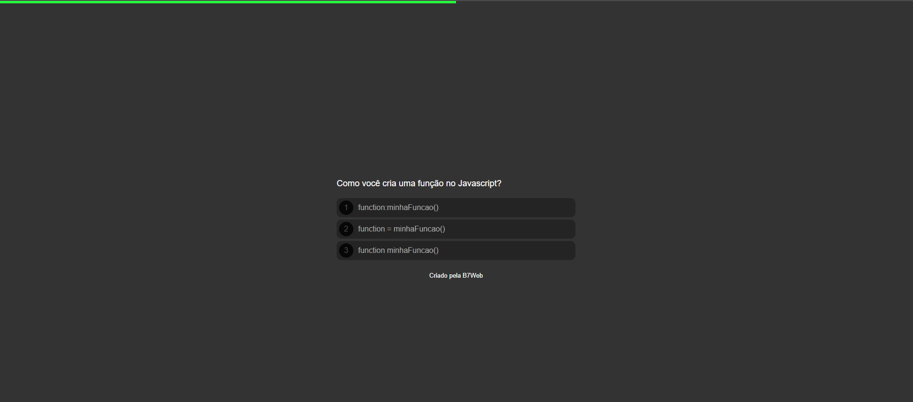
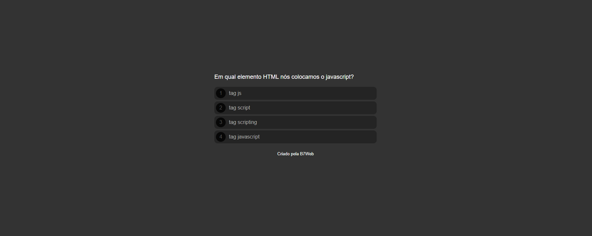
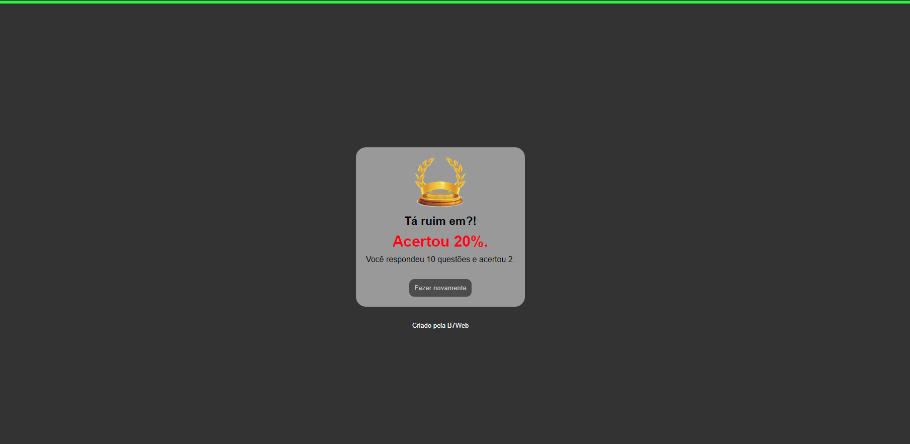

# QUIZ - Perguntas e respostas -  JAVASCRIPT - ES6

- Jogo de perguntas e respostas, apenas uma das 4 alternativas é a correta.

## Stack utilizada

**Front-end:** HTML, Javascript e CSS.

## Screenshots

## Funcionalidades:

- Jogo de perguntas e respostas, apenas uma das 4 alternativas é a correta.

- Barra superior indicativa do final das perguntas, conforma avança nas perguntas a mesma também avança visualmente até atingir 100% da tela.

- Resumo fina, com dados sobre ao aproveitamento da rodada.
## Referência

 - [Plataforma de cursos B7](https://alunos.b7web.com.br/login)

  - [Projeto QUIZ - Perguntas](https://cleytonpinheiro.github.io/quiz-js-b7/)
